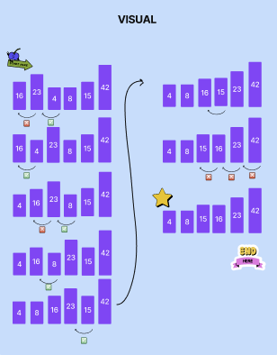
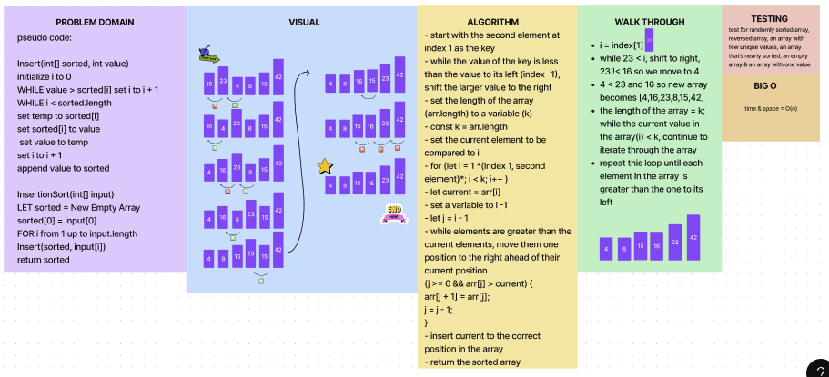

# Insert Sort

## Author: Emily Greason

### Algorithm

- start with the second element at index 1 as the key
- while the value of the key is less than the value to its left (index -1), shift the larger value to the right
- set the length of the array (arr.length) to a variable (k)
  - const k = arr.length
- set the current element to be compared to i
  - for (let i = 1 *(index 1, second element)*; i < k; i++ )
  - let current = arr[i]
- set a variable to i -1
  - let j = i - 1
- while elements  are greater than the current elements, move them one position to the right ahead of their current position
  (j >= 0 && arr[j] > current) {
    arr[j + 1] = arr[j];
    j = --;
  }
- insert current to the correct position in the array
- return the sorted array

#### Full Whiteboard

