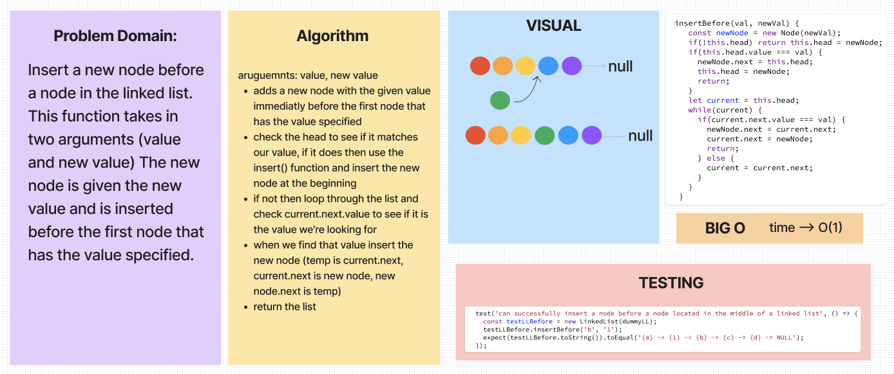
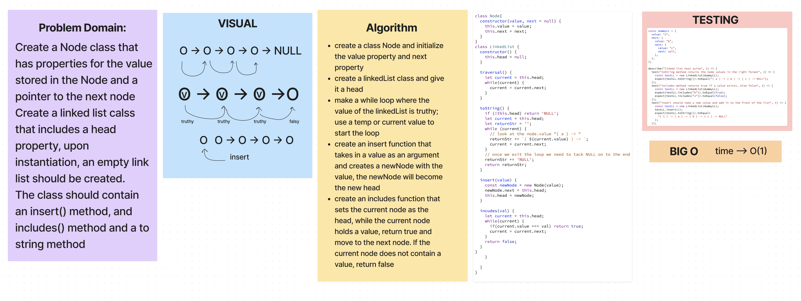

# Challenge 06 & Challenge 07

## Whiteboard Process

## Approach & Efficiency

### append

> ALGOROITHM -->

arguments: new value

- adds a new node with the given value to end of the list
- create a function that takes a NEW value
- make a new node with the value
- traverse to the end
- end node.next will be the new node

### insert before

> ALGOROITHM -->

aruguemnts: value, new value

- adds a new node with the given value immediatly before the first node that has the value specified
- check the head to see if it matches our value, if it does then use the insert() function and insert the new node at the beginning
- if not then loop through the list and check current.next.value to see if it is the value we're looking for
- when we find that value insert the new node (temp is current.next, current.next is new node, new node.next is temp)
- return the list

### insert after

> ALGOROITHM -->

arguments: value, new value

- adds a new node with the given new value immediately after the node that has the value specified
- assign head to current
- loop through the list and check current.value to see if it matches our argument
- temp is current.next
- current.next is new node
- new node.next is temp
- return the list

TESTS!!

- adding a node to the end of a list:
test('append it can insert a node at the end of the list', () => {
  // insert a node and check that the last node of the list matches the value
  // insert it
  // compare it to our expected toString value
  const testLL = new LinkedList(dummyLL);
  testLL.append('d');
  expect(testLL.toString()).toEqual('{a} -> {b} -> {c} -> {d} -> NULL');
})

test('can successfully insert a node before a node located in the middle of a linked list', () => {
  const testLLBefore = new LinkedList(dummyLL);
  testLLBefore.insertBefore('b', '1');
  expect(testLLBefore.toString()).toEqual('{a} -> {1} -> {b} -> {c} -> {d} -> NULL')
});
test('can successfully insert a node after a node located in the middle of a linked list', () => {
  const testLLAfter = new LinkedList(dummyLL);
  testLLAfter.insertAfter('c', '2');
  expect(testLLAfter.toString()).toEqual('{a} -> {b} -> {c} -> {2} -> {d} -> NULL')
});
