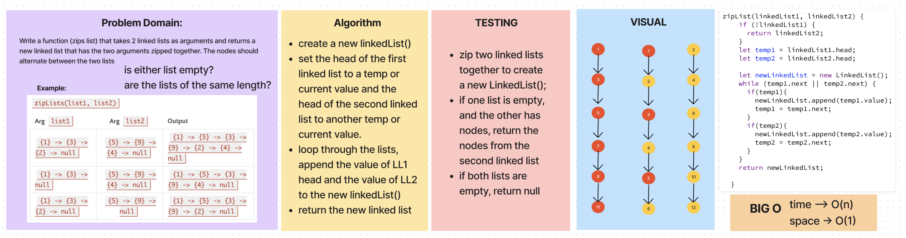

# Challenge 08

## Whiteboard Process

## Approach & Efficiency

> ALGOROITHM -->

- 2 arguments: linkedList1 & linkedList2
- create a newLinkedList
- set the head of the first linked list to a temp value and the head of the second linked list to another temp value
- loop through the lists, append the value of LL1 head and the value of LL2 head to the newLinkedList
- return the newLinkedList
